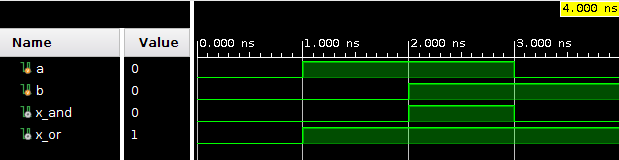
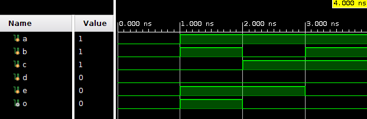

# Proken_FPGA_hisafuru

## combinational_circuit
基本的な組合せ回路.
- myand...and回路
- myor...or回路
- test_circuit...プロ研B第二回での回路

## RGB2HSV
RGB色空間をHSV色空間に変換するフィルタ
「汎用的なHSV色空間変換ハードウェアの開発」を参考に作成

### 参考文献
https://www.jstage.jst.go.jp/article/jceeek/2012/0/2012_375/_pdf
https://www.peko-step.com/tool/hsvrgb.html
https://piraki.hatenadiary.org/entry/20090213/1234514881
https://marsee101.blog.fc2.com/blog-entry-3594.html

## SMOOTHING
様々な平滑化処理を行うためのフィルタ

### moving_avarage
移動平均フィルタ
http://www.kumikomi.net/archives/2009/03/11circ3.php?page=10

### gaussian_blur
ガウシアンぼかしフィルタ
https://imagingsolution.blog.fc2.com/blog-entry-88.html#:~:text=%E7%94%BB%E5%83%8F%E4%B8%AD%E3%81%AE%E3%83%8E%E3%82%A4%E3%82%BA%E3%82%92%E9%99%A4%E5%8E%BB%E3%81%99%E3%82%8B%E3%81%9F%E3%82%81%E3%81%AB%E7%94%A8%E3%81%84%E3%82%89%E3%82%8C%E3%81%BE%E3%81%99%E3%80%82&text=%E5%B9%B3%E6%BB%91%E5%8C%96%E3%83%95%E3%82%A3%E3%83%AB%E3%82%BF%E3%81%AB%E3%81%AF,%E5%87%A6%E7%90%86%E3%81%8C%E4%B8%80%E8%88%AC%E7%9A%84%E3%81%A7%E3%81%99%E3%80%82&text=%E7%A7%BB%E5%8B%95%E5%B9%B3%E5%9D%87%E3%83%95%E3%82%A3%E3%83%AB%E3%82%BF%EF%BC%88%E5%88%A5%E5%90%8D%EF%BC%9A%E5%B9%B3%E5%9D%87,%E5%80%A4%E3%81%A8%E3%81%99%E3%82%8B%E6%89%8B%E6%B3%95%E3%81%A7%E3%81%99%E3%80%82

## PWM
pwmの実装

### 参考文献
http://www.kumikomi.net/archives/2009/03/09circ2.php?page=3
https://monoist.atmarkit.co.jp/mn/articles/0706/06/news132.html
